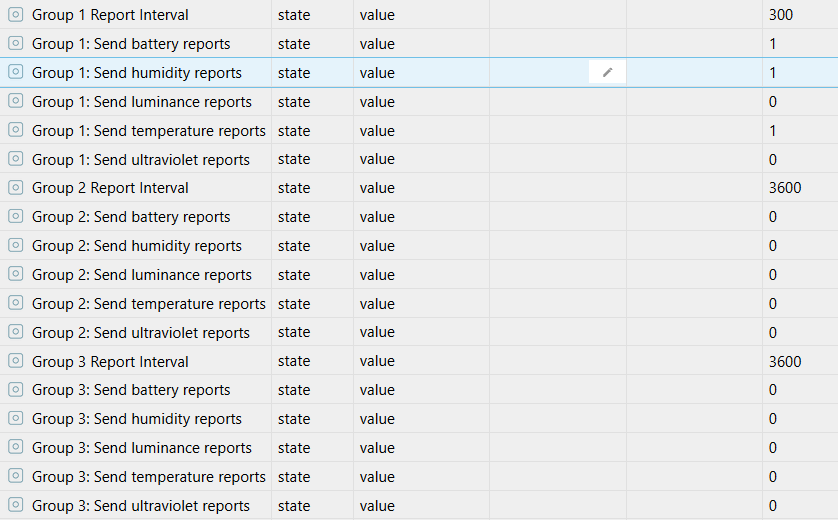
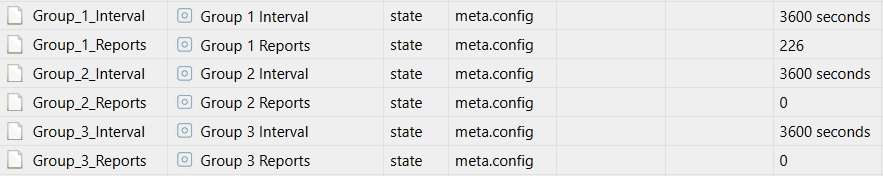

# ioBroker.zwave2

<h2 align="center">Z-Wave for ioBroker. But better.</h3>

Z-Wave 2 is a brand new Z-Wave implementation for ioBroker. It is based on [`zwave-js`](https://github.com/AlCalzone/node-zwave-js), which was written from the ground up for your benefit.

Unless [`ioBroker.zwave`](https://github.com/ioBroker/ioBroker.zwave/) it does not require `OpenZWave`. This means that the installation and updates are fast, and no compilation of static libraries and other complicated steps are necessary.

Furthermore, some devices just don't work in the original adapter, e.g. the Fibaro Roller Shutter 3.

Easy usage in ioBroker was kept in mind during the whole development. For example, some devices reuse configuration parameters to configure many different things. In this adapter, most of them are split into separate states and no complicated math is necessary:
| Config params in ioBroker.zwave2 | vs | Config params in ioBroker.zwave |
| --- | --- | --- |
|  | vs |  |

---

## Documentation and usage
* [FAQ](docs/en/FAQ.md)
* [Troubleshooting](docs/en/troubleshooting.md) · [bei Problemen](docs/de/bei-problemen.md)

---

## Changelog
[Older changes](CHANGELOG_OLD.md)
<!--
	Placeholder for next versions:
	### __WORK IN PROGRESS__
-->
### __WORK IN PROGRESS__
* Fixed some crashes and communication issues

### 3.0.1 (2022-08-27)
* Fixed crashes related to missing or incorrectly loaded dependencies

### 3.0.0 (2022-08-25)
Updated `zwave-js` to `10.0.0`. This includes a ton of changes, including:
* Dropped support for Node.js 12
* Several improvements to secure communication, especially with Security S2
* Changed how nodes are sent to sleep, preventing the queue from stalling when the node is already sleeping
* Changed how `Supervision CC Reports` are sent out, preventing the queue from stalling
* Obfuscated more sensitive data in logfiles
* Fixed a bug where commands that should be discarded would still store their values
* Improved the handling of incoming commands which are received out of order
* Made it possible to disable SmartStart provisioning entries. When excluding a node, its provisioning entry will now be disabled instead of removed.
* New and updated configuration files, see [Z-Wave JS releases](https://github.com/zwave-js/node-zwave-js/releases) for details

### 2.6.0 (2022-05-10)
Updated `zwave-js` to `9.2.2`. Notable changes include:
* The `doorStatus/latchStatus/boltStatus` states are no longer created if unsupported by the door lock
* Fixed an issue where some 500-series controllers would incorrectly be detected as not supporting Smart Start
* Fixed an issue where some incoming reports would not be processed while an API command was ongoing
* Fixed an issue where changing the color of some devices would use a random duration
* Value changes now also get verified when the device sends an intermediate report
* Retry the initial connection to sticks hosted via TCP
* When the Z-Wave stick is disconnected while the adapter is running, the adapter will automatically try to reconnect again
* Improvements to healing and Smart Start
* New and updated configuration files, see [Z-Wave JS releases](https://github.com/zwave-js/node-zwave-js/releases) for details

### 2.5.0 (2022-04-03)
Updated `zwave-js` to `9.0.1`. This includes many changes, including the following:
* Worked around an issue where certain 500-series controllers take too long to respond when attempting communication with unreachable nodes
* Node queries now timeout faster if no response is received. This should avoid battery-powered nodes to go back to sleep mid-interview.
* Add support for `Irrigation CC`
* The legacy network cache file `<homeid>.json` was converted to an appendonly `.jsonl` file in order to prevent data loss
* Almost all CC API methods now validate their arguments, making it safer to execute custom commands from user code
* User codes and network keys are no longer included in logfiles
* Support for legacy devices which only support the obsolete `Multi Channel CC V1`
* New and updated configuration files, see [Z-Wave JS releases](https://github.com/zwave-js/node-zwave-js/releases) for details

### 2.4.5 (2022-02-20)
* Update `zwave-js` to `8.11.6`
* After healing, battery-powered nodes are sent back to sleep again
* Added a workaround for thermostats that don't advertise all their supported thermostat modes. When such a thermostat enters such an "unsupported" mode, the mode is now dynamically added to the list of supported modes.
* New and updated configuration files, see [Z-Wave JS releases](https://github.com/zwave-js/node-zwave-js/releases) for details

## License

MIT License

Copyright (c) 2019-2022 AlCalzone

Permission is hereby granted, free of charge, to any person obtaining a copy
of this software and associated documentation files (the "Software"), to deal
in the Software without restriction, including without limitation the rights
to use, copy, modify, merge, publish, distribute, sublicense, and/or sell
copies of the Software, and to permit persons to whom the Software is
furnished to do so, subject to the following conditions:

The above copyright notice and this permission notice shall be included in all
copies or substantial portions of the Software.

THE SOFTWARE IS PROVIDED "AS IS", WITHOUT WARRANTY OF ANY KIND, EXPRESS OR
IMPLIED, INCLUDING BUT NOT LIMITED TO THE WARRANTIES OF MERCHANTABILITY,
FITNESS FOR A PARTICULAR PURPOSE AND NONINFRINGEMENT. IN NO EVENT SHALL THE
AUTHORS OR COPYRIGHT HOLDERS BE LIABLE FOR ANY CLAIM, DAMAGES OR OTHER
LIABILITY, WHETHER IN AN ACTION OF CONTRACT, TORT OR OTHERWISE, ARISING FROM,
OUT OF OR IN CONNECTION WITH THE SOFTWARE OR THE USE OR OTHER DEALINGS IN THE
SOFTWARE.
