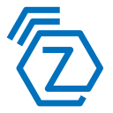

# ioBroker.zwave2

<h2 align="center">Z-Wave for ioBroker. But better.</h3>

Z-Wave 2 is a brand new Z-Wave implementation for ioBroker. It is based on [`zwave-js`](https://github.com/AlCalzone/node-zwave-js), which was written from the ground up for your benefit.

Unless [`ioBroker.zwave`](https://github.com/ioBroker/ioBroker.zwave/) it does not require `OpenZWave`. This means that the installation and updates are fast, and no compilation of static libraries and other complicated steps are necessary.

Furthermore, some devices just don't work in the original adapter, e.g. the Fibaro Roller Shutter 3.

Easy usage in ioBroker was kept in mind during the whole development. For example, some devices reuse configuration parameters to configure many different things. In this adapter, most of them are split into separate states and no complicated math is necessary:
| Config params in ioBroker.zwave2 | vs | Config params in ioBroker.zwave |
| --- | --- | --- |
|  | vs |  |

## Changelog
[Older changes](CHANGELOG_OLD.md)
<!--
	Placeholder for next versions:
	### __WORK IN PROGRESS__
-->

### 1.4.1 (2020-06-30)
* If a node fails to respond to `Multi Channel Endpoint Find`, the interview is no longer aborted and sequential endpoints are assumed instead
* Renamed the manufacturer Goap to Qubino
* For many Qubino devices, the lifeline now uses a node association

### 1.4.0 (2020-06-26)
Updated `zwave-js` to v4.0.1. This includes the following features:
* Improved support for legacy devices that don't include all CCs in the NIF, like `Fibaro FGRM 222`.
* Added support for `Sound Switch CC`
* Added support for `Alarm Sensor CC`. This CC will only be used if `Notification CC` is not supported.

### 1.3.8 (2020-06-18)
* Fixed transmission issues caused by overlapped secure transactions

### 1.3.6 (2020-06-17)
* Added some details to the `Multi Channel Association CC` interview logging
* Configured lifeline node associations of newer devices should now be set correctly
* `CRC-16`-encapsulated commands can now be received
* The log file is complete again

### 1.3.4 (2020-06-16)
* The association UI no longer crashes if an empty association object is returned
* The target endpoint selection for associations is now hidden if an association does not support multiple target endpoints
* Fixed an incompatibility with nodes that have a different number of "normal" associations than multi channel associations, e.g. _FGRM-222_
* The association UI now distinguishes between associations to the device and the root endpoint
* Many fixes related to handling associations and multi channel associations
* Creating a log file works again
* Added support for Devolo Dimmer (MT2760) and Shutter (MT2761) (thanks @nicoh88)
* When the interview process fails to set a lifeline association with `Multi Channel Association CC`, it now tries again with `Association CC`

## License

MIT License

Copyright (c) 2019-2020 AlCalzone

Permission is hereby granted, free of charge, to any person obtaining a copy
of this software and associated documentation files (the "Software"), to deal
in the Software without restriction, including without limitation the rights
to use, copy, modify, merge, publish, distribute, sublicense, and/or sell
copies of the Software, and to permit persons to whom the Software is
furnished to do so, subject to the following conditions:

The above copyright notice and this permission notice shall be included in all
copies or substantial portions of the Software.

THE SOFTWARE IS PROVIDED "AS IS", WITHOUT WARRANTY OF ANY KIND, EXPRESS OR
IMPLIED, INCLUDING BUT NOT LIMITED TO THE WARRANTIES OF MERCHANTABILITY,
FITNESS FOR A PARTICULAR PURPOSE AND NONINFRINGEMENT. IN NO EVENT SHALL THE
AUTHORS OR COPYRIGHT HOLDERS BE LIABLE FOR ANY CLAIM, DAMAGES OR OTHER
LIABILITY, WHETHER IN AN ACTION OF CONTRACT, TORT OR OTHERWISE, ARISING FROM,
OUT OF OR IN CONNECTION WITH THE SOFTWARE OR THE USE OR OTHER DEALINGS IN THE
SOFTWARE.
